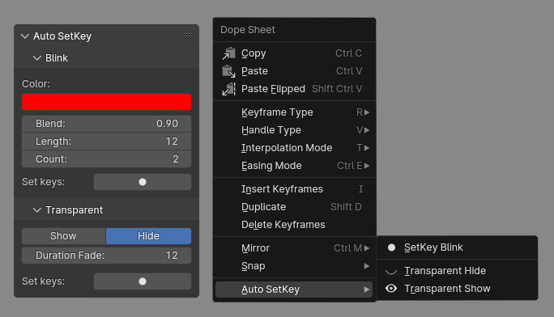

 

# Auto SetKey
Addon for automation of key animation.

- Automatically creates a group in the material
to control color and transparency parameters.

- Inserts keys with specified parameters

# Download
Download [script](https://github.com/VGmove/BlenderAddons/releases/download/BlenderAddons/Auto_SetKey.zip).
